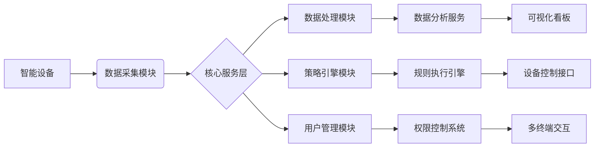

### 智能家居能源管理系统需求设计文档

---

#### **1. 需求概述**

**目标**：设计一个智能化、可扩展的能源管理系统，通过精准监测、数据分析和策略优化，帮助家庭用户降低能耗成本，提升能源使用效率。**核心用户**：

- **家庭用户**：关注能耗成本的家庭成员。
- **物业管理者**：需监控多户能耗的社区或公寓管理者。
- **能源服务商**：提供增值服务的第三方公司。

**使用场景**：

- 实时查看家中设备能耗状态（如空调、热水器、照明）。
- 接收月度能耗报告及异常告警（如设备异常高耗电）。
- 根据电价峰谷时段自动调整设备运行计划（如充电桩夜间充电）。
- 通过移动端远程管理节能策略（如离家时一键关闭非必要设备）。

---

#### **2. 功能需求设计**

##### **2.1 核心功能模块**


| 模块名称         | 功能描述                                                                | 技术实现要点 |
| ---------------- | ----------------------------------------------------------------------- | ------------ |
| **数据采集模块** | 实时采集设备能耗数据（电压、电流、功率），支持多协议设备接入            |              |
| **数据处理模块** | 清洗异常数据（如瞬时峰值）、存储时序数据、生成聚合统计                  |              |
| **可视化看板**   | 展示实时能耗曲线、设备占比图、历史对比分析（同比/环比）                 |              |
| **智能推荐引擎** | 基于用户习惯（如作息时间）和设备特性生成节能建议                        |              |
| **策略管理模块** | 支持用户自定义规则（如“电价>0.5元时关闭热水器”）、自动化脚本（IFTTT） |              |

##### **2.2 详细功能用例**

- **用例1：能耗异常告警**

  - 触发条件：设备功率连续30分钟超阈值（如空调>2000W）。
  - 用户操作：推送告警，并提供“关闭设备”或“忽略”选项。
- **用例2：峰谷电价优化**

  - 系统行为：根据电网实时电价数据，延迟非即时需求的高能耗任务（如洗衣机在22:00后启动）。
- **用例3：个性化报告生成**

  - 输入：用户设置“对比上月节能5%”目标。
  - 输出：周报中标注目标差距，推荐“减少待机设备数量”。

---

#### **3. 非功能性需求**


| 类别       | 需求描述                                                |
| ---------- | ------------------------------------------------------- |
| **性能**   | 数据采集延迟<1秒，分析响应时间<3秒（万级数据点）        |
| **可靠性** | 支持24小时不间断运行，数据丢失率<0.1%                   |
| **安全性** | 数据传输AES-256加密，用户隐私数据匿名化处理（GDPR合规） |
| **扩展性** | 模块化设计，可快速接入新型智能设备（插件式架构）        |

---

#### **4. 技术架构设计**


##### **4.1 整体架构图**




##### **4.2 模块划分与职责**


| 模块名称       | 子模块            | 职责描述                           | 技术实现     |
| -------------- | ----------------- | ---------------------------------- | ------------ |
| **数据采集层** | 1. 传感器接入网关 | 支持Zigbee/Wi-Fi/BLE协议转换       | 多协议栈集成 |
|                | 2. 数据校验服务   | 实时过滤异常数据（如负功率值）     |              |
| **核心服务层** | 1. 能耗计算引擎   | 按设备/房间/时段聚合能耗           |              |
|                | 2. 智能推荐引擎   | 基于用户画像生成节能方案           |              |
| **业务逻辑层** | 1. 策略管理服务   | 处理用户自定义规则（IF-THEN-ELSE） |              |
|                | 2. 告警调度中心   | 实时监测阈值并触发通知             |              |
| **接口层**     | 1. 设备控制API    | 提供设备启停/模式切换接口          | RESTful API  |
|                | 2. 第三方服务网关 | 对接电网电价API/天气预报API        | OAuth2认证   |

##### **4.3 接口设计原则**

* **标准化**：遵循OpenAPI 3.0规范
* **安全性**：HTTPS+JWT双因素认证

##### **4.4 核心接口列表**

###### **4.2.1 设备数据上报接口**

```
POST /api/v1/device/{device_id}/telemetry
Headers:
  Authorization: Bearer <JWT_TOKEN>
Body:
{
  "timestamp": "2023-08-26T14:30:00Z",
  "voltage": 220.5,  // 单位：伏特
  "current": 5.2,    // 单位：安培
  "power": 1146.0    // 单位：瓦特
}
响应码：
  201 Created: 数据接收成功
  400 Bad Request: 数据格式错误
```

###### **4.2.2 节能策略下发接口**

```
PUT /api/v1/policy/{home_id}
Headers:
  Content-Type: application/json
Body示例：
{
  "policy_type": "TIME_BASED",
  "conditions": [
    {
      "device_type": "AIR_CONDITIONER",
      "action": "SET_TEMPERATURE",
      "params": {"value": 26},
      "schedule": {
        "start": "22:00",
        "end": "06:00",
        "weekdays": [1,2,3,4,5]  // 1=周一
      }
    }
  ]
}
响应格式：
{
  "policy_id": "POL-20230826-001",
  "effective_time": "2023-08-26T15:00:00Z"
}
```

##### **4.5 第三方接口集成**


| 接口类型     | 协议      | 频率限制   | 数据示例                               |
| ------------ | --------- | ---------- | -------------------------------------- |
| 电网电价查询 | HTTP/JSON | 100次/小时 | {"peak\_price":0.78, "off\_peak":0.32} |
| 天气数据订阅 | MQTT      | 1次/10分钟 | {"temp":28, "humidity":65}             |

#### **5. 关键问题解决方案**

1. **数据准确性保障**

   - 采用工业级传感器（±1%精度），每日自动校准。
   - 冗余采集：关键设备部署双传感器交叉验证。
2. **个性化推荐优化**

   - 用户画像构建：通过K-means聚类划分“早出晚归型”“居家办公型”等群体。
   - 动态权重调整：冬季侧重供暖设备优化，夏季侧重空调算法。
3. **多设备兼容性**

   - 协议抽象层：封装Zigbee 3.0、Matter等协议为统一接口。
   - 设备驱动仓库：维护开源驱动库，支持用户自助上传新设备驱动。

---

#### **6. 验收标准**


| 阶段     | 验收项示例               | 通过条件                |
| -------- | ------------------------ | ----------------------- |
| 单元测试 | 传感器数据采集误差       | <2%误差（对比专业电表） |
| 集成测试 | 100设备并发接入稳定性    | 持续24小时无崩溃        |
| 用户测试 | 用户完成策略配置平均时间 | <3分钟（可用性测试）    |
